<!-- _class: title-slide -->

# Transformer
<div class="subtitle">Attention Is All You Need
</div>

---
# 學習主題

1. 什麼是 sequence-to-sequence
任務?
2. Encoder 與 Decoder
3. Self-Attention
4. Positional Encoding
5. Residual 與 Layer 
Normalization
6. 實作範例：文字接龍
7. 實作範例：文字翻譯

<div style="position:absolute; top: 190px; left:560px; width:660px; ">

```python
class TinyTransformerLM(nn.Module):
    def __init__(self, vocab_size, d_model=64, nhead=4, num_layers=2):
        super().__init__()
        self.embedding = nn.Embedding(vocab_size, d_model)
        self.pos_encoder = PositionalEncoding(d_model)
        encoder_layer = nn.TransformerEncoderLayer(
            d_model=d_model, nhead=nhead,
            dim_feedforward=128, dropout=0.1, batch_first=True
        )
        self.transformer = nn.TransformerEncoder(
            encoder_layer, num_layers=num_layers
        )
        self.fc = nn.Linear(d_model, vocab_size)
    def forward(self, x):
        x = self.embedding(x)
        x = self.pos_encoder(x)
        x = self.transformer(x)
        logits = self.fc(x)
        return logits
```
</div>

---

## 參考資料： 
- Transformer(上): [https://www.youtube.com/watch?v=n9TlOhRjYoc&t=66s](https://www.youtube.com/watch?v=n9TlOhRjYoc&t=66s)
- Transformer(下): [https://www.youtube.com/watch?v=N6aRv06iv2g](https://www.youtube.com/watch?v=N6aRv06iv2g)
- Self-Attention(上): [https://www.youtube.com/watch?v=hYdO9CscNes&t=203s](https://www.youtube.com/watch?v=hYdO9CscNes&t=203s)
- Self-Attention(下): [https://www.youtube.com/watch?v=gmsMY5kc-zw](https://www.youtube.com/watch?v=gmsMY5kc-zw)
- Transformer 原始論文： A. Vaswani, N. Shazeer, N. Parmar, J. Uszkoreit, L. Jones, A. N. Gomez, L. Kaiser, and I. Polosukhin, “Attention is all you need,” Advances in Neural Information Processing Systems 30, pp. 6000–6010, 2017.
---

# 一、Sequence-to-Sequence 任務
- Transformer 主要處理 Sequence-to-Sequence (Seq2Seq) 問題，它可以把一段序列轉成另一段序列。
    - 範例：
#    
<div align="center">
  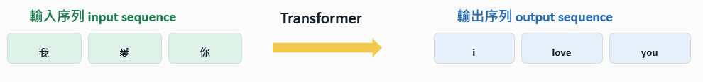
</div>

#
- 應用場域：翻譯、語音辨識、語音合成、摘要、問答、聊天、程式碼補全，都可以看成「讀入一段序列，產生另一段序列」。

---
## Transfomer 可說是深度學習的萬能瑞士刀：萬物皆可 Seq2Seq
<div align="center">
  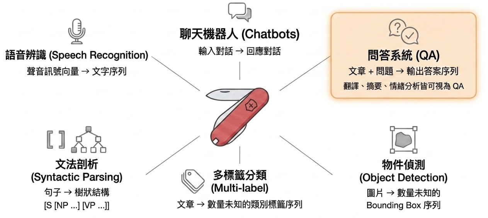
</div>

---
# 二、Encoder 與 Decoder
## 系統架構：
- 左半部：編碼器 (Encoder)
    - 負責理解輸入序列。由N個完全相同的
    疊加層組成，提煉出具有高度語意代表
    性的連續向量表示。
- 右半部：解碼器 (Decoder)
    - 負責生成輸出序列。同樣由N個疊加層
    組成，採用自迴歸(auto-regressive)
    機制，根據已生成的符號預測下一個符號。
#
#


---
## 更進一步說，Encoder 讀懂輸入，Decoder 逐步產生輸出：
- Transformer 把理解與生成分成兩個角色，兩者透過 cross-attention 連接
<div align="center">
  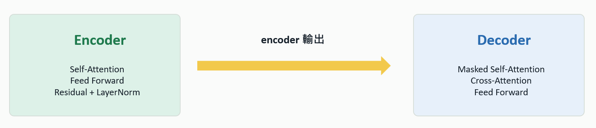
</div>

- 直覺說法： 
    - Encoder 像閱讀理解：把輸入句子轉成上下文化表示。 
    - Decoder 像作文：每次只根據已產生的 token 與 encoder 輸出預測下一個 token。
---
## Encoder block 主要負責建立輸入 token 的上下文表示：
- 每個 token 會在 self-attention 裡和同一句中的其他 token 互相交換資訊。
#
#
#
#
#
#
#
#
#
<div style="position:absolute; top:260px; left:100px; width:1100px; ">

<table class="collection-table">
  <thead>
    <tr>
      <th style ="width:25%; line-height: 1.5;">元件</th>
      <th style ="width:40%; line-height: 1.5;">做什麼</th>
      <th style ="width:35%; line-height: 1.5;">輸入 / 輸出 shape</th>
    </tr>
  </thead>

  <tbody>
    <tr>
      <td style ="line-height: 1.5; text-align:center;">Token embedding</td>
      <td style ="line-height: 1.5; text-align:left;">把 token id 轉成 vector。</td>
      <td style ="line-height: 1.5; text-align:center;">[batch, src_len] -> [batch, src_len, d_model]
      </td>
    </tr>
    <tr>
      <td style ="line-height: 1.5; text-align:center;">Positional encoding</td>
      <td style ="line-height: 1.5; text-align:left;">加入位置資訊，補足 attention 不知道順序的問題。</td>
      <td style ="line-height: 1.5; text-align:center;">shape 不變</td>
    </tr>
    <tr>
      <td style ="line-height: 1.5; text-align:center;">Multi-head self-attention</td>
      <td style ="line-height: 1.5; text-align:left;">讓每個輸入 token 依內容決定要看其他哪些 token。</td>
      <td style ="line-height: 1.5; text-align:center;">shape 不變</td>
    </tr>
    <tr>
      <td style ="line-height: 1.5;text-align:center;">Feed-forward network</td>
      <td style ="line-height: 1.5; text-align:left;">對每個位置做非線性轉換，提升表示能力。</td>
      <td style ="line-height: 1.5; text-align:center;">shape 不變</td>
    </tr>
  </tbody>
</table>

</div>

---
## Decoder block 會一邊看已產生的輸出，一邊讀 encoder 輸出：
- 關鍵觀察點：生成第 t 個 token 時，不應該偷看第 t+1 個答案，所以會有 Masked self-attention。
#
#
#
#
#
#
#
#
#
<div style="position:absolute; top:260px; left:100px; width:1100px; ">

<table class="collection-table">
  <thead>
    <tr>
      <th style ="width:25%; line-height: 1.5;">元件</th>
      <th style ="width:40%; line-height: 1.5;">做什麼</th>
      <th style ="width:35%; line-height: 1.5;">為什麼需要</th>
    </tr>
  </thead>

  <tbody>
    <tr>
      <td style ="line-height: 1.5; text-align:center;">Masked self-attention</td>
      <td style ="line-height: 1.5; text-align:left;">只允許 decoder 看見目前與過去 token。</td>
      <td style ="line-height: 1.5; text-align:left;">避免訓練時偷看未來答案。
      </td>
    </tr>
    <tr>
      <td style ="line-height: 1.5; text-align:center;">Cross-attention</td>
      <td style ="line-height: 1.5; text-align:left;">用 decoder 的 query 去讀 encoder output。</td>
      <td style ="line-height: 1.5; text-align:left;">把輸入資訊拿來生成輸出。</td>
    </tr>
    <tr>
      <td style ="line-height: 1.5; text-align:center;">Feed-forward network</td>
      <td style ="line-height: 1.5; text-align:left;">對每個輸出位置做更深的特徵轉換。</td>
      <td style ="line-height: 1.5; text-align:left;">增加非線性與表示能力。</td>
    </tr>
    <tr>
      <td style ="line-height: 1.5;text-align:center;">Linear + Softmax</td>
      <td style ="line-height: 1.5; text-align:left;">把 hidden vector 轉成下一個 token 的機率。</td>
      <td style ="line-height: 1.5; text-align:left;">讓模型可以逐步產生需要的輸出。</td>
    </tr>
  </tbody>
</table>

</div>

---
## 完整 Transformer 會把多個可重複 block 串起來：
- Encoder 與 Decoder block 都會重複 N 次，讓模型逐層建立更抽象的序列表示。
<div align="center">
  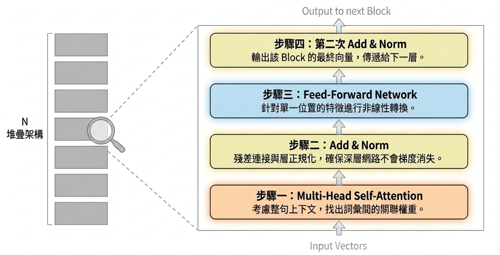
</div>

---
# 三、Self-Attention
- 每個 token embeeding 會被投影成 query (Q)、key (K)、value (V) 三種角色
- 每個 token 會透過這三種角色決定該看誰、看多少、拿到什麼資訊

#
<div align="center">
  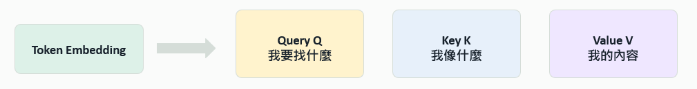
</div>

#

---
## 實際的運作邏輯：
- 每一個輸入向量都會透過學習到的權重矩陣，生成三個專屬角色： Q、K、V。拿自己的 Q 去跟所有人的 K 進行內積，決定提取多少 V 的資訊。
<div align="center">
  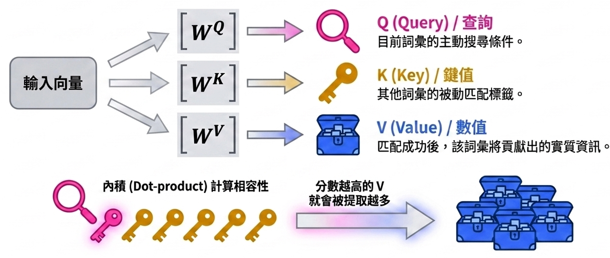
</div>

---
## 權重矩陣：
- Attention weight 是一個分配：決定目前 token 從其他 token 收集多少資訊
  - 例如「貓」這個 token 可以把
  一部分注意力放在「喜歡」，
  因為動詞與受詞之間有語意關
  係。
  - 模型不是手寫規則，而是從資料
  中學出這些權重。
  - 這些權重會乘上向量 V，決定每
  一個 token 提取多少資訊。
#
#
#
#
#
#
#    


---
<!-- ## 總結 Self-Attention 的計算： -->
## Scaled Dot-Product Attention:
<div align="center">
  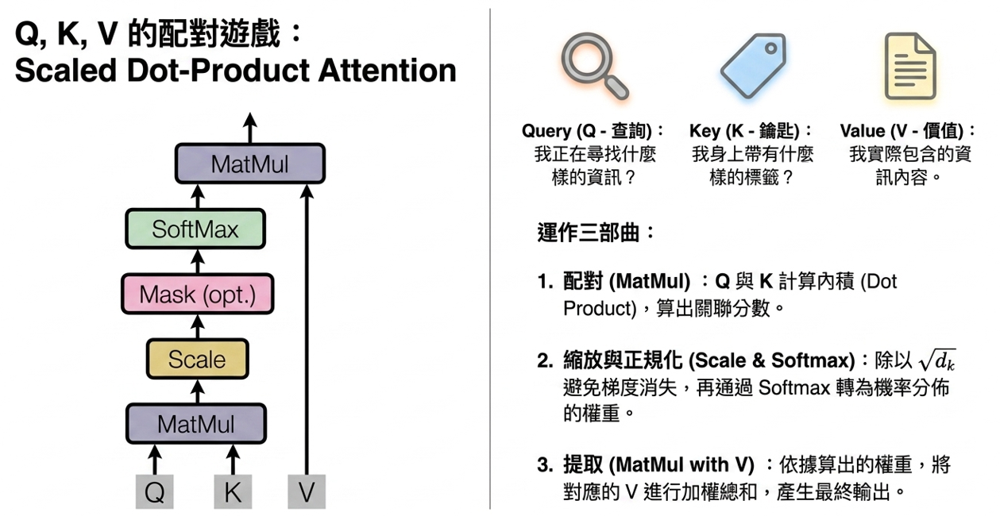
</div>

---
## 多頭注意力 (Multi-Head Attention)：捕捉多維度的特徵
<!-- - 單一頭的盲點：如果只做一次 attention，所有的關聯特徵會被平均化，失去細節。
- 多頭分工合作：將 Q、K、V 投影到多個不同的低維度空間平行執行。不同的 head 會自動學到不同的任務，且運算成本與單頭幾乎相同。 -->
<div align="center">
  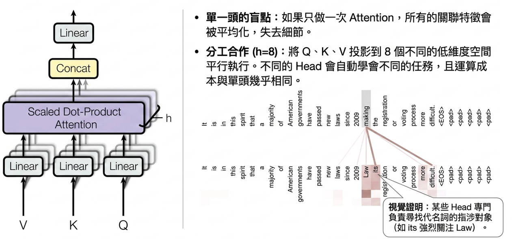
</div>

---
## 總結：Multi-Head Attention 讓模型同時看多種關係
- 一個 head 只能形成一套注意力分配，多個 head 可以平行學多種語意關係。
#
#
#
#
#
#
#
#
#
<div style="position:absolute; top:260px; left:100px; width:1100px; ">

<table class="collection-table">
  <thead>
    <tr>
      <th style ="width:15%; line-height: 1.5;">概念</th>
      <th style ="width:40%; line-height: 1.5;">單一 head</th>
      <th style ="width:45%; line-height: 1.5;">多個 head</th>
    </tr>
  </thead>

  <tbody>
    <tr>
      <td style ="line-height: 1.5; text-align:center;">關係類型</td>
      <td style ="line-height: 1.5; text-align:left;">一套 attention pattern。</td>
      <td style ="line-height: 1.5; text-align:left;">多套 attention pattern。</td>
    </tr>
    <tr>
      <td style ="line-height: 1.5; text-align:center;">表示空間</td>
      <td style ="line-height: 1.5; text-align:left;">所有資訊被迫放在同一個投影空間。</td>
      <td style ="line-height: 1.5; text-align:left;">不同 head 可學不同投影空間。</td>
    </tr>
    <tr>
      <td style ="line-height: 1.5; text-align:center;">輸出方式</td>
      <td style ="line-height: 1.5; text-align:left;">直接得到 attention output。</td>
      <td style ="line-height: 1.5; text-align:left;">Concat 各 head 結果，再經線性層混合。</td>
    </tr>
    <tr>
      <td style ="line-height: 1.5;text-align:center;">課堂直覺</td>
      <td style ="line-height: 1.5; text-align:left;">一位助教看句子。</td>
      <td style ="line-height: 1.5; text-align:left;">多位助教分別看語法、語意、位置關係。</td>
    </tr>
  </tbody>
</table>

</div>

---
## Masked and Cross Attention:
<!-- - Decoder 會依序產生一個個的token，因此在處理時不應該看到之後的token。 -->
<div align="center">
  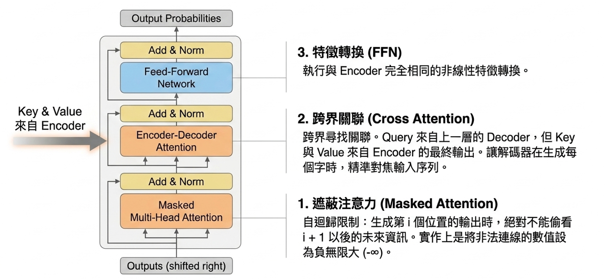
</div>

---
# 四、Positional Encoding
- Attention 在運作時並沒有參考位置資訊，因此同樣字組的文字經 attention 運作的結果是相同的。為此 attention 需要額外位置訊息，才能知道 token 的先後順序。
#
<div align="center">
  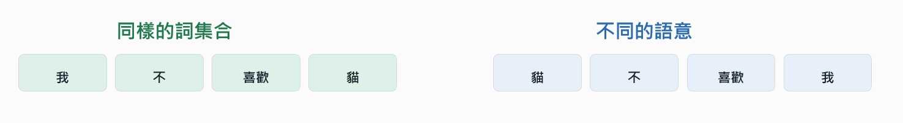
</div>

# 
-  如果模型只看 token 內容，這兩句話會很像。加入位置向量後，每個 token embedding 都帶著「我在第幾個位置」的訊息，模型才能分辨語序。

---
## 位置編碼的運作機制：
<div align="center">
  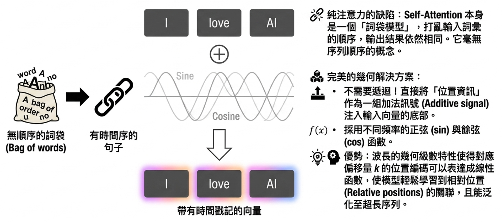
</div>

---
# 五、Residual 與 Layer Normalization
- 深層模型要穩定訓練，需要保留原訊息並控制表示尺度。
#
<div align="center">
  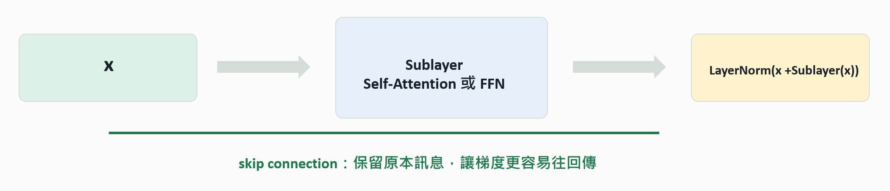
</div>

---
## 穩定訓練的護城河： Add & Norm
<div align="center">
  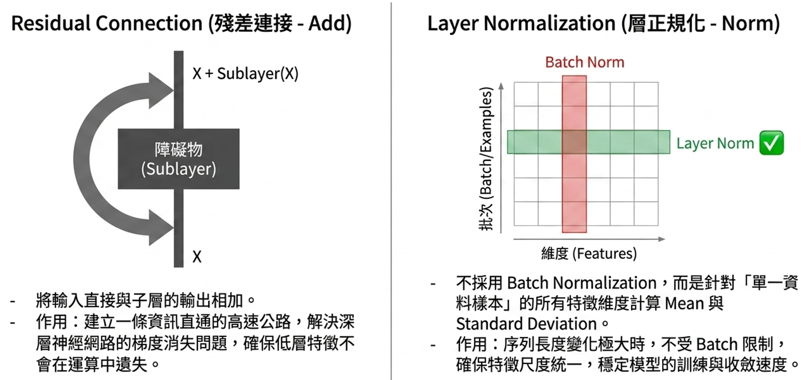
</div>

---
## Add & Norm 的常見結構：
- 每個子層外面包一個 residual connection 和 layer normalization
#
#
#
#
#
#
#
#
#
<div style="position:absolute; top:260px; left:40px; width:1200px; ">

<table class="collection-table">
  <thead>
    <tr>
      <th style ="width:20%; line-height: 1.5;">機制</th>
      <th style ="width:50%; line-height: 1.5;">直覺</th>
      <th style ="width:30%; line-height: 1.5;">訓練上的好處</th>
    </tr>
  </thead>

  <tbody>
    <tr>
      <td style ="line-height: 1.5; text-align:center;">Residual Connection</td>
      <td style ="line-height: 1.5; text-align:left;">輸出 = 原本 x + 子層學到的修正。</td>
      <td style ="line-height: 1.5; text-align:left;">保留訊息、改善梯度流動。</td>
    </tr>
    <tr>
      <td style ="line-height: 1.5; text-align:center;">Layer Normalization</td>
      <td style ="line-height: 1.5; text-align:left;">對每個 token 的 hidden dimensions 標準化。</td>
      <td style ="line-height: 1.5; text-align:left;">穩定尺度、減少訓練震盪。</td>
    </tr>
    <tr>
      <td style ="line-height: 1.5; text-align:center;">Dropout</td>
      <td style ="line-height: 1.5; text-align:left;">訓練時隨機關掉部分 activations。</td>
      <td style ="line-height: 1.5; text-align:left;">降低過度依賴與 overfitting。</td>
    </tr>
    <tr>
      <td style ="line-height: 1.5;text-align:center;">Feed Forward</td>
      <td style ="line-height: 1.5; text-align:left;">對每個位置獨立做 MLP。</td>
      <td style ="line-height: 1.5; text-align:left;">增加非線性與轉換能力。</td>
    </tr>
  </tbody>
</table>

</div>

---

# 六、Transformer 的訓練
- 輸入與輸出：
  - 不同的應用其輸入與輸出都不相同
  - 文字接龍： 輸入是一串文字，輸出是下一個字
  - 中翻英： 輸入是中文，輸出是英文
- 分類問題：
  - 多數的 transformer 應用其輸出都是一個個的token
  - Token 是不連續的元素且個數是有限的，因此 transformer 處理的問題本質上可以看成是分類問題
- 損失函數:
  - 因此多數 transformer 問題都是採用 cross-entropy 作為損失函數，並用一般常見的優化器進行訓練

---
# 七、範例一：文字接龍
- 應用場域：給定一串文字，預測下一個中文字。
- 訓練目標：輸入一段長度 block_size 的文字，答案是右移一格的文字。
#
#
#
#
- 重點：這是一個只有 encoder 的範例，因此對於 transformer 的應用而言，不一定 encoder 及 decoder 都需要。

<div class="flow-wrap" style="position:absolute; top:350px; left:80px; width:1100px;" >

  <div class="flow-box flow-green">
    <div class="flow-title">原始文字</div>
  </div>

  <div class="flow-line"></div>

  <div class="flow-box flow-blue">
    <div class="flow-title">字元字彙表</div>
  </div>

  <div class="flow-line"></div>

  <div class="flow-box flow-green" style="width:260px;">
    <div class="flow-title">token id</div>
  </div>

  <div class="flow-line"></div>

  <div class="flow-box flow-blue">
    <div class="flow-title">x: 前 16 字</div>
  </div>

  <div class="flow-line"></div>

  <div class="flow-box flow-green">
    <div class="flow-title">y: 後 16 字</div>
  </div>

  <div class="flow-line"></div>

  <div class="flow-box flow-blue">
    <div class="flow-title">Transformer Encoder</div>
  </div>

  <div class="flow-line"></div>

  <div class="flow-box flow-green">
    <div class="flow-title">Linear</div>
  </div>

  <div class="flow-line"></div>
  <div class="flow-box flow-blue">
    <div class="flow-title">下一字機率</div>
  </div>
</div>

---
1. 匯入相關套件以及設定簡單的訓練資料
```python
import torch
import torch.nn as nn
import math
from collections import Counter

text = """
機器學習是人工智慧的重要領域。
深度學習可以從大量資料中學習規律。
Transformer 是一種處理序列資料的模型。
它使用注意力機制來理解文字之間的關係。
語言模型可以根據前面的文字預測下一個字。
學生可以透過簡單範例理解 Transformer 的基本架構。
"""
```
---
2. 建立字彙表 (Tokenization)
```python
counter = Counter(text) # 計算每個字的出現次數 
chars = [ch for ch, count in counter.most_common()] # 依照出現次數排序
stoi = {ch: i for i, ch in enumerate(chars)} # 建立文字到數字的對應 (stoi 可把字轉成 id)
itos = {i: ch for ch, i in stoi.items()} # 建立數字到文字的對應 (itos 可把 id 轉回字)

vocab_size = len(chars)

data = torch.tensor([stoi[ch] for ch in text], dtype=torch.long) # 將文字轉成 token id

print("vocab size:", vocab_size)
print("data shape:", data.shape)
print(chars)
print(stoi['機']) # 顯示'機'這個字的編碼
print(itos[stoi['器']]) # 驗證 stoi 及 itos 兩個編碼表互為反函數
print(data) # 顯示整段文字的 token id 序列 
```
---
3. 建立取得批次資料的函數 (get_batch)
  - x 是目前看到的文字，y 是下一步要預測的答案
```python
block_size = 16 # block_size 控制 context 長度
batch_size = 8 # batch_size 控制一次訓練幾段文字

def get_batch():
    ix = torch.randint(0, len(data) - block_size - 1, (batch_size,))
    x = torch.stack([data[i:i+block_size] for i in ix])
    y = torch.stack([data[i+1:i+block_size+1] for i in ix]) # y 比 x 右移一格
    return x, y

x, y = get_batch()
print(x.shape, y.shape)
print("x[0] =", "".join(itos[i.item()] for i in x[0]))
print("y[0] =", "".join(itos[i.item()] for i in y[0]))    
```
---
4. 建立 PositionEncoding 類別
```python
class PositionalEncoding(nn.Module):
    def __init__(self, d_model, max_len=5000):
        super().__init__()
        pe = torch.zeros(max_len, d_model) # 建立一個形狀為 [max_len, d_model] 的 2D 張量

        # 生成一維序列 [0, 1, 2, ..., max_len-1]後再轉成 [max_len, 1] 的 2D 張量
        position = torch.arange(0, max_len).unsqueeze(1) # unsqueeze 可插入一個新維度
        
        div_term = torch.exp( 
            torch.arange(0, d_model, 2) * (-math.log(10000.0) / d_model)
        ) # 計算 Transformer 論文中的分母縮放項
        pe[:, 0::2] = torch.sin(position * div_term) # 計算偶數通道的正弦值
        pe[:, 1::2] = torch.cos(position * div_term) # 計算奇數通道的餘弦值
        self.register_buffer("pe", pe.unsqueeze(0)) # 將 pe 插入一個 batch 維度
        # 將 pe 註冊為 nn.Module 的 Buffer，讓它不計算梯度，但可一起移到 cuda 又能支援存檔
    def forward(self, x):
        return x + self.pe[:, :x.size(1)]
```
---
5. 建立 transformer 類別
```python
class TinyTransformerLM(nn.Module):
    def __init__(self, vocab_size, d_model=64, nhead=4, num_layers=2):
        super().__init__()
        self.embedding = nn.Embedding(vocab_size, d_model) # 建立「單字ID->高維向量」的離散查找表
        self.pos_encoder = PositionalEncoding(d_model) # 建立位置編碼類別
        encoder_layer = nn.TransformerEncoderLayer(
            d_model=d_model, nhead=nhead, dim_feedforward=128, # Feed-Forword 的維度為 128
            dropout=0.1, batch_first=True # 第一個維度屬於 batch 的 size
        )
        self.transformer = nn.TransformerEncoder(
            encoder_layer, num_layers=num_layers) # num_layers 代表有幾個 block
        self.fc = nn.Linear(d_model, vocab_size)
    def forward(self, x):
        x = self.embedding(x)
        x = self.pos_encoder(x)
        x = self.transformer(x)
        return self.fc(x)
```
---
6. 設定損失函數及優化器後，開始進行訓練
```python
device = "cuda" if torch.cuda.is_available() else "cpu"
model = TinyTransformerLM(vocab_size).to(device)
optimizer = torch.optim.AdamW(model.parameters(), lr=1e-3)
loss_fn = nn.CrossEntropyLoss()

for step in range(1000):
    x, y = get_batch()
    x = x.to(device)
    y = y.to(device)
    logits = model(x)
    loss = loss_fn(logits.reshape(-1, vocab_size), y.reshape(-1)) # 將資料攤平後計算 loss
    optimizer.zero_grad()
    loss.backward()
    optimizer.step()
    if step % 100 == 0:
        print(step, loss.item())
```
---
7. 定義生成函數並進行測試
```python
def generate(model, start_text, max_new_tokens=80):
    model.eval()
    ids = [stoi[ch] for ch in start_text] # 將輸入文字轉成 token id 序列
    x = torch.tensor(ids, dtype=torch.long).unsqueeze(0).to(device) # 插入 batch 維度
    for _ in range(max_new_tokens):
        x_cond = x[:, -block_size:] # 因長度有限制，故只保留最後 block_size 個字作為輸入
        logits = model(x_cond)
        next_logits = logits[:, -1, :] # 只抓出最後一個位置（-1）對字典中各個字詞的分數
        probs = torch.softmax(next_logits, dim=-1) # 將得分透過 softmax 函數轉為機率
        next_id = torch.multinomial(probs, num_samples=1)  # 依照機率分佈抽樣(不是最大機率)
        x = torch.cat([x, next_id], dim=1) # 將新抽樣出的單字ID拼接到原本序列的末端

    result = "".join(itos[i] for i in x[0].tolist()) # 將所有字元串接成完整的字串
    return result

print(generate(model, "機器學習", 80)) # 開始進行文字接龍，"機器學習"為起始文字，最多80個字
```

---
# 八、範例二：中翻英
- 應用場域：給定一串中文字，翻成英文。
- 訓練目標：source 是中文，target 是英文。 Decoder 訓練時使用 teacher forcing。
#
#
#
#
- 重點：和文字接龍不同，翻譯需要 encoder 讀中文，decoder 產生英文，因此 mask 與 padding 的角色更明顯。

<div class="flow-wrap" style="position:absolute; top:350px; left:80px; width:1100px;" >

  <div class="flow-box flow-green">
    <div class="flow-title">中文句對</div>
  </div>

  <div class="flow-line"></div>

  <div class="flow-box flow-blue">
    <div class="flow-title">來源字彙</div>
  </div>

  <div class="flow-line"></div>

  <div class="flow-box flow-green" style="width:260px;">
    <div class="flow-title">目標字彙</div>
  </div>

  <div class="flow-line"></div>

  <div class="flow-box flow-blue">
    <div class="flow-title">Padding</div>
  </div>

  <div class="flow-line"></div>

  <div class="flow-box flow-green">
    <div class="flow-title">目標輸入</div>
  </div>

  <div class="flow-line"></div>

  <div class="flow-box flow-blue">
    <div class="flow-title">目標輸出</div>
  </div>

  <div class="flow-line"></div>

  <div class="flow-box flow-green">
    <div class="flow-title">Transformer</div>
  </div>

  <div class="flow-line"></div>
  <div class="flow-box flow-blue">
    <div class="flow-title">英文句對</div>
  </div>
</div>

---
1. 匯入相關套件以及中英文語句資料。
```python
import torch
import torch.nn as nn
import math

pairs = [
    ("我愛你", "i love you"),
    ("我喜歡貓", "i like cats"),
    ("我喜歡狗", "i like dogs"),
    ("他是學生", "he is a student"),
    ("她是老師", "she is a teacher"),
    ("今天天氣好", "the weather is good today"),
    ("我正在學習", "i am learning"),
    ("我學習機器學習", "i study machine learning"),
    ("這是一本書", "this is a book"),
    ("你喜歡音樂", "you like music"),
]
```
---
2. 建立來源語言(中文)特殊 token 及字彙表
```python
SRC_PAD = "<pad>" # 中文端 padding token，用來把不同長度的中文句子補成一樣長。
SRC_UNK = "<unk>" # 中文端 UNK token，是 unknown 的意思，用來表示「字彙表裡沒有的字」。

src_chars = sorted(list(set("".join(src for src, tgt in pairs)))) # 建立中文字彙表

src_itos = [SRC_PAD, SRC_UNK] + src_chars # 在中文字彙表中加入特殊 token
src_stoi = {ch: i for i, ch in enumerate(src_itos)} # 建立中文反向字彙表

src_pad_id = src_stoi[SRC_PAD] # 取得 padding token id 
src_unk_id = src_stoi[SRC_UNK] # 取得 UNK token id

print(src_stoi)
```
---
3. 建立目標語言(英文)特殊 token 及字彙表
```python
TGT_PAD = "<pad>" # 英文端 padding token，用來把不同長度的中文句子補成一樣長。
TGT_UNK = "<unk>" # 英文端 UNK token，是 unknown 的意思，用來表示「字彙表裡沒有的字」。
TGT_SOS = "<sos>" # Start token，讓 decoder 知道起點
TGT_EOS = "<eos>" # End token，讓 decoder 知道應該停止了

tgt_chars = sorted(list(set("".join(tgt for src, tgt in pairs)))) # 建立英文字彙表

tgt_itos = [TGT_PAD, TGT_UNK, TGT_SOS, TGT_EOS] + tgt_chars # 在英文字彙表中加入特殊 token
tgt_stoi = {ch: i for i, ch in enumerate(tgt_itos)} # 建立英文反向字彙表

tgt_pad_id = tgt_stoi[TGT_PAD]  # 取得 padding token id 
tgt_unk_id = tgt_stoi[TGT_UNK]  # 取得 UNK token id 
tgt_sos_id = tgt_stoi[TGT_SOS]  # 取得 start token id 
tgt_eos_id = tgt_stoi[TGT_EOS]  # 取得 end token id 

print(tgt_stoi)
```
---
4. 建立來源及目標語言編碼函數以及文句補 padding token 函數
```python
def encode_src(text): # 將中文文句轉成 token id 序列
    return [src_stoi.get(ch, src_unk_id) for ch in text]
def encode_tgt(text): # 將英文句子轉成 token id 序列
    return [tgt_sos_id] + [tgt_stoi.get(ch, tgt_unk_id) for ch in text] + [tgt_eos_id]
print(encode_src("我愛你"))
print(encode_tgt("i love you"))

def pad_sequences(sequences, pad_id): # 把句子加上 padding token 變成固定長度
    max_len = max(len(seq) for seq in sequences)
    result = []

    for seq in sequences:
        padded = seq + [pad_id] * (max_len - len(seq))
        result.append(padded)

    return torch.tensor(result, dtype=torch.long)
```
---
5. 建立來源及目標語言的訓練資料 
```python
src_sequences = [encode_src(src) for src, tgt in pairs] # 將中文文句轉成 token id 序列
tgt_sequences = [encode_tgt(tgt) for src, tgt in pairs] # 將英文句子轉成 token id 序列
print(src_sequences)
print(tgt_sequences)
src_batch = pad_sequences(src_sequences, src_pad_id) # 將所有中文文句變成相同長度
tgt_batch = pad_sequences(tgt_sequences, tgt_pad_id) # 將所有英文句子變成相同長度
print(src_batch.shape)
print(tgt_batch.shape)

# 建立訓練時 decoder 所需的輸入及輸出token id 序列資料 (使用 teacher forcing 機制)
tgt_input = tgt_batch[:, :-1] # 選取從第 0 個位置到倒數第 2 個位置（即去掉最後一個 token）
tgt_output = tgt_batch[:, 1:] # 選取從第 1 個位置到最後一個位置（即去掉第一個 token）
print(tgt_input.shape)
print(tgt_output.shape)
```
---
6. 建立 PositionEncoding 類別 
```python
class PositionalEncoding(nn.Module):
    def __init__(self, d_model, max_len=500):
        super().__init__()
        pe = torch.zeros(max_len, d_model) # 建立一個形狀為 [max_len, d_model] 的 2D 張量

        # 生成一維序列 [0, 1, 2, ..., max_len-1]後再轉成 [max_len, 1] 的 2D 張量
        position = torch.arange(0, max_len).unsqueeze(1) # unsqueeze 可插入一個新維度
        
        div_term = torch.exp( 
            torch.arange(0, d_model, 2) * (-math.log(10000.0) / d_model)
        ) # 計算 Transformer 論文中的分母縮放項
        pe[:, 0::2] = torch.sin(position * div_term) # 計算偶數通道的正弦值
        pe[:, 1::2] = torch.cos(position * div_term) # 計算奇數通道的餘弦值
        self.register_buffer("pe", pe.unsqueeze(0)) # 將 pe 插入一個 batch 維度
        # 將 pe 註冊為 nn.Module 的 Buffer，讓它不計算梯度，但可一起移到 cuda 又能支援存檔
    def forward(self, x):
        return x + self.pe[:, :x.size(1)]
```
---
7. 建立 transformer 類別 
```python
class TransformerTranslator(nn.Module):
    def __init__(
        self, src_vocab_size, tgt_vocab_size, d_model=64, nhead=4,
        num_encoder_layers=2, num_decoder_layers=2, dim_feedforward=128, dropout=0.1):
        super().__init__()
        self.d_model = d_model
        self.src_embedding = nn.Embedding(src_vocab_size, d_model) # 建立來源語言的離散查找表
        self.tgt_embedding = nn.Embedding(tgt_vocab_size, d_model) # 建立目標語言的離散查找表
        self.pos_encoder = PositionalEncoding(d_model) # 建立 encoder 位置編碼類別
        self.pos_decoder = PositionalEncoding(d_model) # 建立 decoder 位置編碼類別
        self.transformer = nn.Transformer( # 設定 transformer 相關參數 (幾個head，幾個block)
            d_model=d_model, nhead=nhead, num_encoder_layers=num_encoder_layers,
            num_decoder_layers=num_decoder_layers, dim_feedforward=dim_feedforward,
            dropout=dropout, batch_first=True
        )
        self.fc_out = nn.Linear(d_model, tgt_vocab_size) # 最後的線性轉換層
```
---
```python
    def forward(self, src, tgt, src_key_padding_mask=None,
        tgt_key_padding_mask=None, memory_key_padding_mask=None, tgt_mask=None ):

        src_emb = self.src_embedding(src) * math.sqrt(self.d_model)
        tgt_emb = self.tgt_embedding(tgt) * math.sqrt(self.d_model)
        src_emb = self.pos_encoder(src_emb) # 加入 encoder 位置編碼
        tgt_emb = self.pos_decoder(tgt_emb) # 加入 decoder 位置編碼

        output = self.transformer(
            src_emb,
            tgt_emb,
            tgt_mask=tgt_mask, # 避免 decoder 偷看未來 token
            src_key_padding_mask=src_key_padding_mask, # 遮蔽來源語言的 padding token
            tgt_key_padding_mask=tgt_key_padding_mask, # 遮蔽目標語言的 padding token
            memory_key_padding_mask=memory_key_padding_mask # 在解碼時，遮蔽來源語言的padding token
        )

        logits = self.fc_out(output)
        return logits        
```
---
8. 定義 tgt_mask 以及 padding_mask 的建立函數
```python
def generate_square_subsequent_mask(size):
    # 建立一個方陣，其中主對角線(diagonal=1 表示不包含主對角線)以上的數值為 1，其餘為 0
    mask = torch.triu(torch.ones(size, size), diagonal=1) 
    # 將 mask 矩陣中數值為 1 的位置填為 -inf (負無窮大)，表示這個位置對應的 token 會被遮蔽
    mask = mask.masked_fill(mask == 1, float("-inf"))
    return mask

# 若輸入 token id 串列中的 id == pad_id，將此位置設為 true，其餘為 false
def create_padding_mask(seq, pad_id):
    return seq == pad_id 
```
---
9. 建立 transformer 物件實體並設定優化器以及損失函數
```python
device = "cuda" if torch.cuda.is_available() else "cpu"

model = TransformerTranslator(  # 建立 transformer 物件實體
    src_vocab_size=len(src_itos), # Encoder輸入序列的長度
    tgt_vocab_size=len(tgt_itos), # Decoder輸入序列的長度
    d_model=64, # token 向量維度
    nhead=4, # 多頭注意力中的 head 個數
    num_encoder_layers=2, # Encoder block 個數
    num_decoder_layers=2  # Decoder block 個數
).to(device)

optimizer = torch.optim.AdamW(model.parameters(), lr=1e-3) # 採用 AdamW 優化器

loss_fn = nn.CrossEntropyLoss(ignore_index=tgt_pad_id) # 使用 cross entropy 損失函數
```
---
10. 建立訓練迴圈並開始進行訓練
```python
for epoch in range(1000):
    model.train()
    src_batch_dev = src_batch.to(device) 
    tgt_input_dev = tgt_input.to(device)
    tgt_output_dev = tgt_output.to(device)
    tgt_mask = generate_square_subsequent_mask(tgt_input.size(1)).to(device) 
    src_padding_mask = create_padding_mask(src_batch, src_pad_id).to(device)
    tgt_padding_mask = create_padding_mask(tgt_input, tgt_pad_id).to(device)
    logits = model(src_batch_dev, tgt_input_dev,
        src_key_padding_mask=src_padding_mask, tgt_key_padding_mask=tgt_padding_mask,
        memory_key_padding_mask=src_padding_mask, tgt_mask=tgt_mask)
    loss = loss_fn( logits.reshape(-1, len(tgt_itos)), tgt_output_dev.reshape(-1))
    optimizer.zero_grad()
    loss.backward()
    optimizer.step()
    if epoch % 100 == 0:
        print(f"epoch {epoch}, loss = {loss.item():.4f}")
```
---
11. 利用已訓練好的 transformer 模型，建立中翻英的翻譯函數
```python
def translate(model, src_text, max_len=50):
    model.eval()
    src_ids = encode_src(src_text) # 將輸入文字轉成 token id 串列
    src = torch.tensor(src_ids, dtype=torch.long).unsqueeze(0).to(device) # 加一維度並轉成張量
    src_padding_mask = create_padding_mask(src, src_pad_id).to(device)
    tgt_ids = [tgt_sos_id] # Decoder 的輸入一開始只有起始 token
    for _ in range(max_len): # 逐一處理每一個字元 
        tgt = torch.tensor(tgt_ids, dtype=torch.long).unsqueeze(0).to(device) # 加一維度並轉成張量
        tgt_mask = generate_square_subsequent_mask(tgt.size(1)).to(device)
        logits = model(src, tgt, src_key_padding_mask=src_padding_mask,
            tgt_key_padding_mask=None, memory_key_padding_mask=src_padding_mask, tgt_mask=tgt_mask)
        next_logits = logits[:, -1, :] # 取出 decoder 最後一個輸出對應的 token 分數
        next_id = torch.argmax(next_logits, dim=-1).item() # 找出 token 對應的 id
        if next_id == tgt_eos_id: # 若結果等於結束 token，則停止運算
            break
        tgt_ids.append(next_id) # 將得到的結果加入目前的 tgt_ids 串列
    result = "".join(tgt_itos[i] for i in tgt_ids[1:]) # 最後將 tgt_ids 串列轉成對應的文字
    return result
```    
---
12. 進行中翻英模型的測試
```python
print(translate(model, "我愛你"))
print(translate(model, "我喜歡貓"))
print(translate(model, "他是學生"))
print(translate(model, "這是一本書"))
print(translate(model, "我喜歡機器學習"))
```  
---
# 本章總結
- 重點檢查表
#
#
#
#
#
#
#
#
#
<div style="position:absolute; top:260px; left:100px; width:1100px; ">

<table class="collection-table">
  <thead>
    <tr>
      <th style ="width:40%; line-height: 1.5;">做什麼</th>
      <th style ="width:60%; line-height: 1.5;">為什麼需要</th>
    </tr>
  </thead>

  <tbody>
    <tr>
      <td style ="line-height: 1.5; text-align:left;">只允許 decoder 看見目前與過去 token。</td>
      <td style ="line-height: 1.5; text-align:left;">避免訓練時偷看未來答案。
      </td>
    </tr>
    <tr>
      <td style ="line-height: 1.5; text-align:left;">用 decoder 的 query 去讀 encoder output。</td>
      <td style ="line-height: 1.5; text-align:left;">把輸入資訊拿來生成輸出。</td>
    </tr>
    <tr>
      <td style ="line-height: 1.5; text-align:left;">對每個輸出位置做更深的特徵轉換。</td>
      <td style ="line-height: 1.5; text-align:left;">增加非線性與表示能力。</td>
    </tr>
    <tr>
      <td style ="line-height: 1.5; text-align:left;">把 hidden vector 轉成下一個 token 的機率。</td>
      <td style ="line-height: 1.5; text-align:left;">讓模型可以逐步產生需要的輸出。</td>
    </tr>
  </tbody>
</table>

</div>
